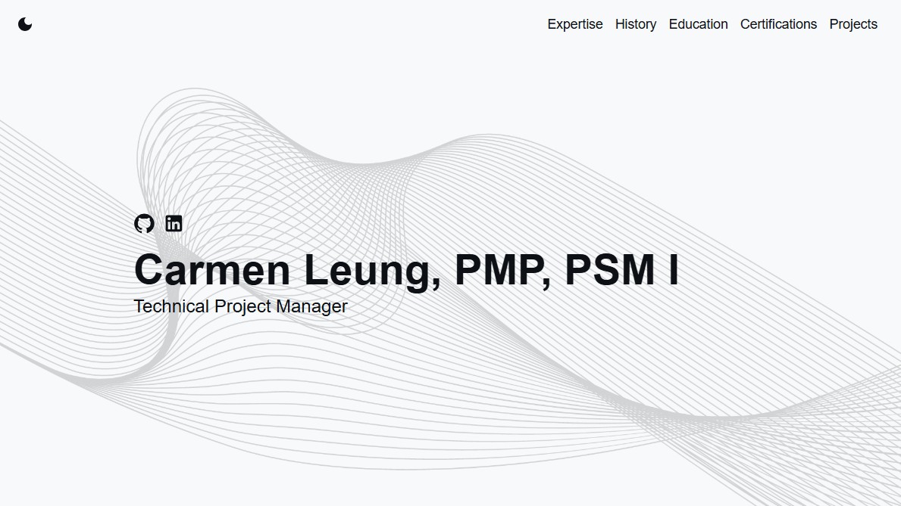

# Carmen Leung's Portfolio

This repository contains the source code for my personal portfolio website, showcasing my skills, career history, and personal projects.

**[View the Live Demo](https://kamanl16.github.io/my-portfolio)**

---



## About This Project

This portfolio was built from the ground up using modern web technologies to serve as a central hub for my professional and personal work. The goal was to create a clean, responsive, and fast-loading site that effectively tells my story as a developer and project manager.

## Features

- **Fully Responsive:** Adapts to all screen sizes, from mobile phones to desktop displays.
- **Light & Dark Mode:** Includes a theme switcher for user preference.
- **Interactive Timeline:** A vertical timeline to visualize my career progression.
- **Dynamic Content:** Easily updatable sections for expertise and projects.

## Technologies Used

This project was built with:

- **React:** For building the user interface.
- **TypeScript:** For static typing and improved code quality.
- **Material-UI (MUI):** For a comprehensive suite of UI components and a robust theming system.
- **GitHub Pages:** For hosting and deployment.
- **GitHub Actions:** For continuous integration and deployment automation.

## Local Setup

To run this project locally, follow these steps:

1.  **Clone the repository:**
    ```bash
    git clone [https://github.com/kamanl16/my-portfolio.git](https://github.com/kamanl16/my-portfolio.git)
    ```

2.  **Navigate to the project directory:**
    ```bash
    cd my-portfolio
    ```

3.  **Install dependencies:**
    ```bash
    npm install
    ```

4.  **Start the development server:**
    ```bash
    npm start
    ```
    The application will be available at `http://localhost:3000`.

## Contact

You can reach me at:
- **LinkedIn:** [https://www.linkedin.com/in/kamanl16/](https://www.linkedin.com/in/kamanl16/)
- **GitHub:** [https://github.com/kamanl16](https://github.com/kamanl16)
